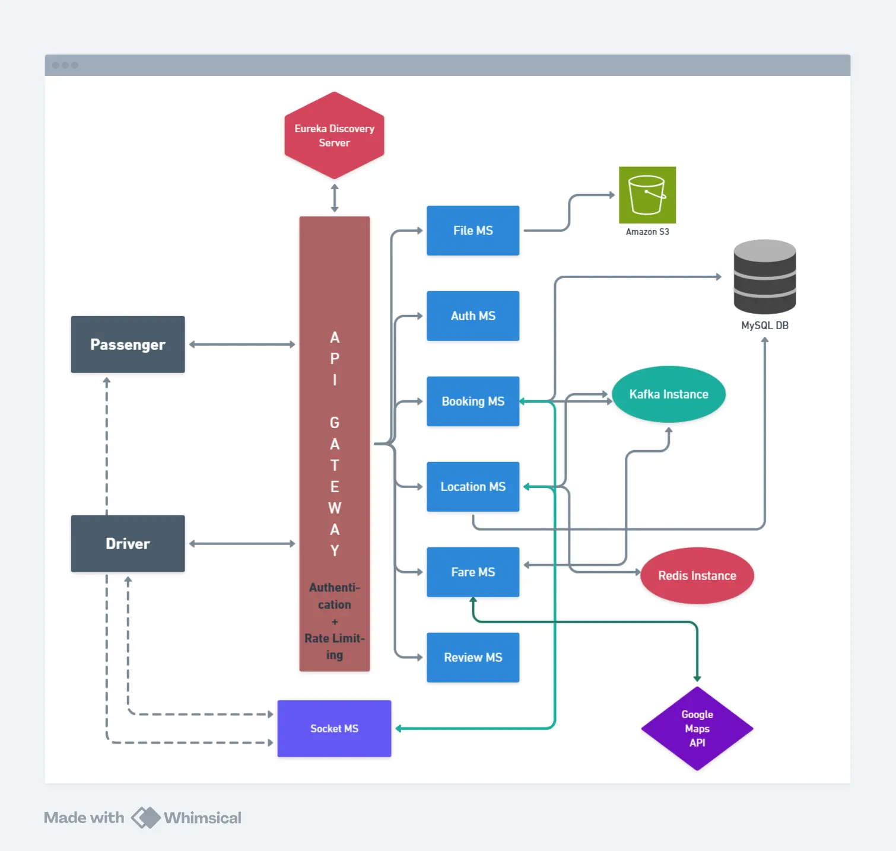

# HeavyDriver - Ride Hailing System (Microservices Architecture)

This project is a scalable **ride hailing backend** built with a **microservices architecture**.  
Each microservice has its own repository. This repository serves as a central documentation hub.

If you want to have a deep dive in engineering behind this project. You should check it on : https://heavydriver.app/engineering

---

## 🚀 Tech Stack
- **Backend:** Spring Boot (Java)
- **Frontend:** Vite (React), SockJS, Google Maps API
- **Database:** MySQL, Redis
- **Async Communication:** Apache Kafka
- **Service Discovery:** Netflix Eureka
- **Authentication:** JWT (HttpOnly)
- **Others:** WebSockets (STOMP), Redis GeoHash, Flyway migrations

---

## 🏗️ Microservices Overview
- **Eureka Service Discover Server** → [Repo Link](https://github.com/mrstmcpp/HeavyDriver-EurekaDiscoveryService)
- **API Gateway** → [Repo Link](https://github.com/mrstmcpp/HeavyDriver-ApiGateway)
- **Client Socket Service** → [Repo Link](https://github.com/mrstmcpp/HeavyDriver-ClientSocketService)
- **Location Service** → [Repo Link](https://github.com/mrstmcpp/HeavyDriver-LocationService)
- **Auth Service** → [Repo Link](https://github.com/mrstmcpp/HeavyDriver-AuthService)
- **Booking Service** → [Repo Link](https://github.com/mrstmcpp/HeavyDriver-BookingService)
- **Fare Service** → [Repo Link](https://github.com/mrstmcpp/HeavyDriver-FareService)
- **Review Service** → [Repo Link](https://github.com/mrstmcpp/HeavyDriver-ReviewService)
- **Passenger Frontend** → [Repo Link](https://github.com/mrstmcpp/heavydriver-frontend)
- **Driver Frontend** → [Repo Link](https://github.com/mrstmcpp/HeavyDriver-Driver-Frontend)
- **Entity Repo** → [Repo Link](https://github.com/mrstmcpp/HeavyDriver-EntityService)
  
---

## 📌 Features
- Checkout official Engineering page designed for engineers <3 : https://heavydriver.app/engineering
---
## 📂 Architecture Diagram


---


## ⚡ Running Locally
For quick start:
1. Clone all the repo in your local system in a folder.
2. Inside the folder containing all the git cloned repo, make a .env file containing following variables.
```env
GOOGLE_MAPS_API_KEY=your_google_maps_api_key
GOOGLE_MAPS_MAP_ID=your_google_maps_api_map_id
AWS_ACCESS_KEY=your_aws_access_key
AWS_SECRET_KEY=your_aws_secret_key

VITE_AUTH_BACKEND_URL=http://localhost:3006/api/v1/auth
VITE_REVIEW_BACKEND_URL=http://localhost:3006/api/v1
VITE_LOCATION_BACKEND_URL=http://localhost:3006/api/v1/location
VITE_BOOKING_BACKEND_URL=http://localhost:3006/api/v1/booking
VITE_SOCKET_BACKEND_URL=http://localhost:3004/ws
VITE_PASSENGER_FRONTEND=http://localhost:8080

VITE_GATEWAY_BACKEND_URL=http://localhost:3006/api/v1
VITE_DRIVER_BACKEND_URL=http://localhost:3006/api/v1/driver

VITE_GOOGLE_MAPS_API_KEY=your_google_maps_api_key
VITE_GOOGLE_MAPS_MAP_ID=your_google_maps_api_map_id
```
3. Now, put `docker-compose.yml` inside the same folder.
4. Finally, just hit your terminal with `docker compose build`.
5. When builds finishes, just hit again `docker compose up -d`.
6. Now, you can access your passenger's client at `localhost:8080` & driver's client at `localhost:8081`.
---
